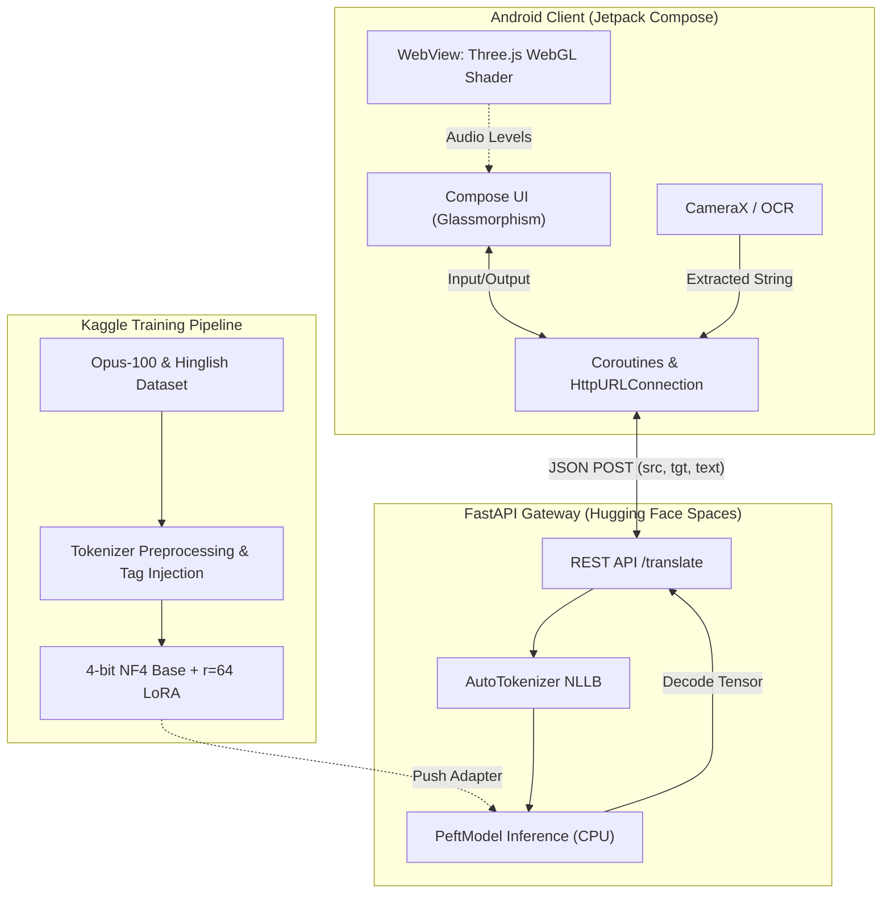
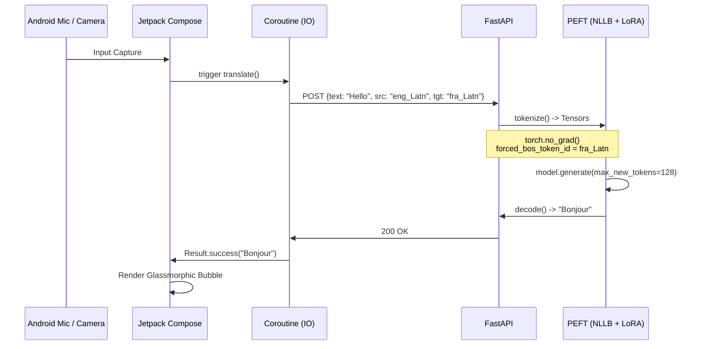

# 🌍 PolyTalk AI (Technical Documentation)

  
  
  
  
  

 

**PolyTalk AI** is an advanced neural machine translation ecosystem. This repository contains the complete technical implementation, spanning the QLoRA fine-tuning pipeline, the Hugging Face inference backend, and the state-of-the-art Android client utilizing WebGL shaders and CameraX.

---

## 🏗️ System Architecture

---

## 🧠 Phase 1: Neural Machine Translation (QLoRA)

To avoid the immense computational cost of full-parameter fine-tuning on a 1.3 Billion parameter model (`facebook/nllb-200-1.3B`), PolyTalk AI utilizes **Quantized Low-Rank Adaptation (QLoRA)**. 

### Data Assembly & Preprocessing
The model was trained on 18 languages, utilizing **559,000 parallel sentences**.
1. **Source:** `Helsinki-NLP/opus-100` (28,000 rows per language pair).
2. **Code-Switching:** Injected `findnitai/english-to-hinglish` to support informal internet dialect (Hinglish).
3. **Deterministic Shuffling:** Datasets were concatenated and shuffled with a fixed seed (`seed=42`) to prevent *Catastrophic Forgetting* during sequential training.
4. **Tokenization Hack:** NLLB relies on mathematically explicit language tokens. During the `preprocess_function` across the 559k dataset, the first token `label[0]` of every target tensor was mathematically overwritten using `tokenizer.convert_tokens_to_ids()` to inject the specific NLLB target tag (e.g., `hin_Deva`, `tam_Taml`).

### QLoRA Configuration
The base model was aggressively compressed while maintaining 16-bit precision training for the adapter.
* **Quantization:** `BitsAndBytesConfig` was used to load the base model in **4-bit NF4** (NormalFloat4) with double quantization.
* **LoRA Adapter:** A `PeftModel` was attached with a rank of `r=64` and `lora_alpha=128`. We targeted the `q_proj` (Query) and `v_proj` (Value) attention modules.
* **Trainable Parameters:** This configuration yielded exactly **18.8 Million trainable parameters** (a tiny fraction of the 1.3B base), allowing it to fit on a single 15GB Kaggle GPU.

### Endurance Training
* **Compute:** `Seq2SeqTrainer` utilizing `gradient_accumulation_steps=8` and `batch_size=2` to simulate a batch size of 16 without throwing CUDA OOM errors.
* **Training Notebook:** [Kaggle: PolyTalk AI QLoRA Training](https://www.kaggle.com/code/kunaljitkashyap/polytalk-ai-fine-tuning-a-1-3b-model-on-18-langua/notebook)
* **Model Adapter (LoRA):** The final adapter was saved and pushed to the Hugging Face model hub: [heykunal123/polytalk-ai-lora-nllb-1.3b](https://huggingface.co/heykunal123/polytalk-ai-lora-nllb-1.3b).

---

## ⚙️ Phase 2: FastAPI Backend Inference

The API gateway acts as the bridge between the Android client and the AI model. It is designed to run efficiently on Hugging Face Free CPU Spaces.

* **Live API Backend:** [Hugging Face Space: polytalk-ai-backend](https://huggingface.co/spaces/heykunal123/polytalk-ai-backend)

### Inference Logic
1. **Model Instantiation:** Upon startup, the global scope loads the base `facebook/nllb-200-1.3B` and applies the `heykunal123/polytalk-ai-lora-nllb-1.3b` adapter via `PeftModel.from_pretrained()`. The model is forced into `.eval()` mode.
2. **API Endpoint (`POST /translate`):**
   - Validates input using a Pydantic `BaseModel`.
   - Modifies the global `tokenizer.src_lang` dynamically per request.
   - Converts the requested string target language into its specific token ID (`target_lang_id`).
   - Executes generation within a `torch.no_grad()` block to disable gradient tracking and save memory.
   - Uses `forced_bos_token_id=target_lang_id` to strictly command the model into outputting the desired language space.
   - Max generation length is capped at `max_new_tokens=128`.

---

## 📱 Phase 3: Android Client (Jetpack Compose)

The frontend is a fully reactive, state-driven Android application utilizing the latest Jetpack Compose architectural patterns.

### 1. Camera OCR Engine (`CameraOcrScreen.kt`)
- **CameraX Implementation:** Implements a headless `PreviewView` bound to the compose lifecycle (`ProcessCameraProvider`).
- **State Freezing:** Upon initiating a scan, the viewfinder extracts the active bitmap (`previewView?.bitmap`) and overlays it instantly on the UI, simulating a mechanical shutter freeze.
- **Hardware Integration:** Utilizes `android.speech.tts.TextToSpeech` to vocalize the decoded translation and `LocalClipboardManager` for OS-level text copying.

### 2. 3D Aura Visualizer (`visualizer.html` & `Three.js`)
Real-time voice feedback is rendered at 60FPS using a hardware-accelerated WebGL canvas, embedded securely via an Android `WebView`.
- **GLSL Vertex Shaders:** The core geometry is a `SphereGeometry (40x40 segments)`. A custom vertex shader applies **Simplex Noise (snoise)** mathematics to displace vertices along their normals based on dynamic amplitude variables.
- **GLSL Fragment Shaders:** The material utilizes Fresnel algorithms to calculate rim lighting against the view vector (`dot(normal, viewDir)`). Specular highlights are injected based on a simulated light direction.
- **JS-Android Bridge:** The Android app computes microphone decibel levels and passes them rapidly into the WebView via `evaluateJavascript("window.updateAudioLevel(level)")`, directly modifying the shader uniforms in real-time.

### 3. Network & Coroutines (`PolyTalkApiClient.kt`)
- All network operations execute on `Dispatchers.IO`.
- Graceful fallbacks are built-in: If the production Hugging Face Space times out, the client automatically re-routes to `http://10.0.2.2:8000` to support local Android Emulator development.
- The `languageMap` dictionary structurally couples the human-readable UI dropdowns ("Hindi") to the mathematically required NLLB tags ("hin_Deva").

---

