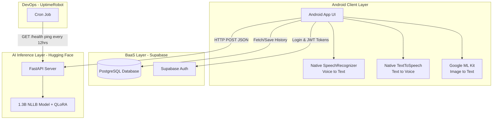

# PolyTalk AI 🌍

PolyTalk AI is an advanced, intelligent translation platform designed to seamlessly connect the world through real-time communication. This repository contains the complete source code and research for the PolyTalk AI ecosystem, separated into three core modules.

## 🚀 Project Modules

### 1. [🧠 Fine-Tuned Model](./model)
The core intelligence of PolyTalk AI is powered by a custom language model (1.3 Billion parameters). 
* **Capabilities:** Specifically trained and fine-tuned to understand and translate across 18 distinct languages with high colloquial accuracy.
* **Resources:** Contains the datasets, fine-tuning scripts, and Jupyter notebooks used for model training and evaluation metrics.

### 2. [⚙️ Backend Infrastructure](./backend)
The robust, scalable infrastructure that bridges the AI model and the client applications.
* **Architecture:** Designed for low-latency, real-time translation processing using a Python FastAPI server running in a Docker container on Hugging Face Spaces.
* **Features:** Exposes secure RESTful API endpoints for text translation, speech-to-text (STT), text-to-speech (TTS), and OCR image data extraction.

### 3. [📱 Android App (Frontend)](./frontend)
A state-of-the-art Android application built with modern **Jetpack Compose**.
* **Design:** Features a premium, glassmorphic UI with dynamic micro-animations.
* **Features:**
  * **Real-time Voice Translation:** 3D animated "jelly-blob" visualizer powered by Three.js and WebGL shaders for fluid voice feedback.
  * **Camera OCR (Live Text):** Google Lens-style live scanning UI that freezes the camera frame for instant text translation.
  * **Interactive Chat:** Seamless Gemini-style conversation interface for back-and-forth multi-lingual translations.

---

## 🏗️ High-Level System Architecture

PolyTalk AI relies on a microservices-based architecture that orchestrates 4 main layers to provide a seamless multimodal experience:

### 🔐 Authentication Flow & Security

Authentication is securely handled across 4 distinct systems working in tandem to prevent unauthorized access and API abuse:

1. **Google Cloud Console (The Gatekeeper):**
   * Acts as the master security guard. It generates the required OAuth 2.0 Client IDs.
   * We register an **Android Client ID** coupled with the specific `SHA-1` signing fingerprint of the build machine. This strictly ensures that only the genuine, compiled PolyTalk Android app is allowed to request an identity token.

2. **The Android App (The Client):**
   * When a user taps *"Continue with Google"*, the app contacts Google Play Services on the device. 
   * It requests a secure **Google ID Token** using a Web Client ID. Google verifies the app's `SHA-1` signature before issuing this temporary token.

3. **Supabase (The Identity Provider & Database):**
   * The Android app hands the newly minted Google ID Token over to Supabase.
   * Supabase securely verifies the token's cryptographic signature directly with Google. Upon successful verification, it registers the user (if new) and issues a secure **Supabase Session Token (JWT)**.

4. **The FastAPI Backend (The Inference Engine):**
   * The custom Hugging Face backend is stateless and solely dedicated to heavy ML inference.
   * Whenever the Android app requests a translation (text, voice, or OCR), it attaches the **Supabase Session Token** in the HTTP Authorization header.
   * The backend validates the JWT signature. Only authenticated requests are allowed to consume GPU resources, protecting the AI infrastructure from abuse.
