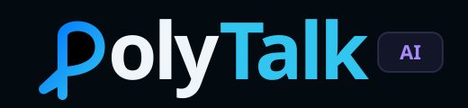
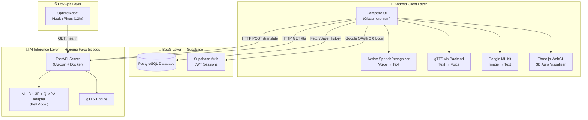
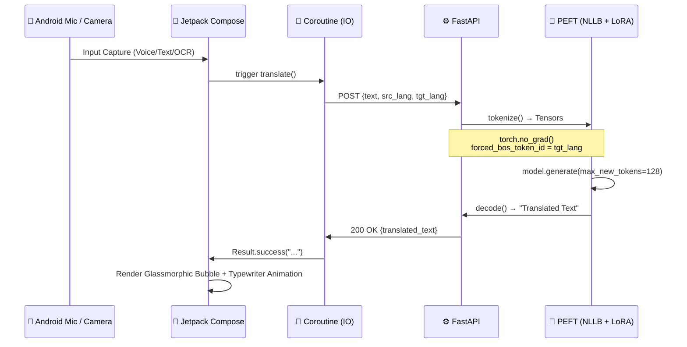
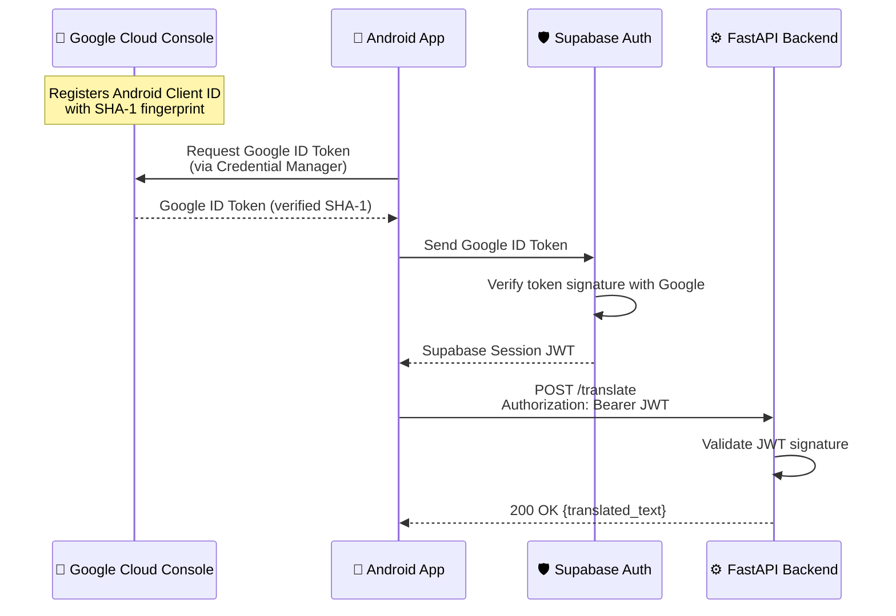
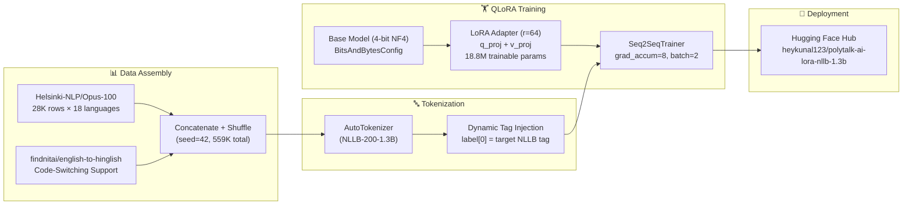

<div align="center">
  
  <br/>
  <em>Translate. Speak. Connect.</em>
  <br/><br/>

  
  
  
  
  
  

  <br/><br/>

  [🤗 Hugging Face Model](https://huggingface.co/heykunal123/polytalk-ai-lora-nllb-1.3b) •
  [📓 Kaggle Notebook](https://www.kaggle.com/code/kunaljitkashyap/polytalk-ai-fine-tuning-a-1-3b-model-on-18-langua) •
  [📱 Android App](./android%20frontend) •
  [⚙️ Backend](./backend)

</div>

---

## 📖 Overview

**PolyTalk AI** is a full-stack, multimodal neural machine translation platform that translates across **18 languages** in real-time. The project spans three layers:

1. **🧠 Custom Fine-Tuned Model** — A 1.3 Billion parameter NLP model (`facebook/nllb-200-1.3B`) fine-tuned with **QLoRA** on 559K parallel sentences, published to Hugging Face Hub.
2. **⚙️ Scalable Backend** — A **Python FastAPI** inference server containerized with **Docker** and deployed on **Hugging Face Spaces**, exposing REST APIs for translation, text-to-speech, and health monitoring.
3. **📱 Android App** — A premium **Kotlin/Jetpack Compose** application with **4 translation modes** — text, voice, camera OCR, and conversational chat — featuring glassmorphic UI, 3D WebGL audio visualizers, and secure Google OAuth 2.0 authentication.

### 🌍 Supported Languages

<div align="center">

| Indian Languages | International Languages |
|:---:|:---:|
| 🇮🇳 Hindi | 🇫🇷 French |
| 🇮🇳 Tamil | 🇪🇸 Spanish |
| 🇮🇳 Telugu | 🇩🇪 German |
| 🇮🇳 Bengali | 🇮🇹 Italian |
| 🇮🇳 Marathi | 🇷🇺 Russian |
| 🇮🇳 Gujarati | 🇯🇵 Japanese |
| 🇮🇳 Kannada | 🇬🇧 English |
| 🇮🇳 Malayalam | |
| 🇮🇳 Punjabi | |
| 🇮🇳 Odia | |
| 🇮🇳 Assamese | |

</div>

---

## 🏗️ High-Level System Architecture

The platform orchestrates **4 distinct layers** to deliver a seamless multimodal translation experience:



---

## 🔬 Low-Level System Diagrams

### Translation Inference Flow

End-to-end sequence from user input to translated output:



### Authentication Security Flow

4-layer authentication pipeline preventing unauthorized API access:



### QLoRA Training Pipeline

How the model was trained from raw data to deployed adapter:



---

## 🧠 Phase 1: Model Training (QLoRA Fine-Tuning)

To avoid the immense computational cost of full-parameter fine-tuning on a 1.3B parameter model, PolyTalk AI utilizes **Quantized Low-Rank Adaptation (QLoRA)**.

### Data Assembly & Preprocessing

The model was trained on **559,000 parallel sentences** across 18 languages:

| Component | Details |
|---|---|
| **Primary Dataset** | `Helsinki-NLP/opus-100` — 28,000 sentence pairs per language |
| **Code-Switching** | `findnitai/english-to-hinglish` — informal internet dialect support |
| **Shuffling** | Deterministic shuffle (`seed=42`) to prevent *Catastrophic Forgetting* |
| **Tokenization Hack** | Dynamic NLLB tag injection: `label[0]` overwritten with `tokenizer.convert_tokens_to_ids()` per target language |

### QLoRA Configuration

The base model was aggressively compressed while maintaining 16-bit precision for the adapter:

```python
# 4-bit Quantization Config
BitsAndBytesConfig(
    load_in_4bit=True,
    bnb_4bit_use_double_quant=True,
    bnb_4bit_quant_type="nf4",
    bnb_4bit_compute_dtype=torch.float16
)

# LoRA Adapter Config
LoraConfig(
    r=64,                              # Rank 64 for 18-language capacity
    lora_alpha=128,
    target_modules=["q_proj", "v_proj"], # Attention Query & Value matrices
    lora_dropout=0.05,
    task_type=TaskType.SEQ_2_SEQ_LM
)
```

| Parameter | Value |
|---|---|
| **Base Model** | `facebook/nllb-200-1.3B` |
| **Trainable Parameters** | 18.8M (of 1.3B total) |
| **Quantization** | 4-bit NormalFloat4 (NF4) with double quantization |
| **Training** | `Seq2SeqTrainer`, `gradient_accumulation_steps=8`, `batch_size=2` |
| **Compute** | Kaggle GPU (15GB VRAM, T4) |
| **Published Adapter** | [heykunal123/polytalk-ai-lora-nllb-1.3b](https://huggingface.co/heykunal123/polytalk-ai-lora-nllb-1.3b) |

---

## ⚙️ Phase 2: Backend Infrastructure

The FastAPI gateway bridges the Android client and the AI model, designed to run efficiently on Hugging Face Free CPU Spaces.

### API Endpoints

| Method | Endpoint | Description |
|---|---|---|
| `POST` | `/translate` | Translates text between any 2 of 18 languages |
| `GET` | `/tts?text=...&lang=...` | Text-to-speech via gTTS, streams MP3 audio |
| `GET` | `/languages` | Returns all 18 supported language codes |
| `GET` | `/` | Health check (used by UptimeRobot) |

### Inference Logic

1. **Startup:** Loads `facebook/nllb-200-1.3B` base model and attaches the `heykunal123/polytalk-ai-lora-nllb-1.3b` adapter via `PeftModel.from_pretrained()`. Model enters `.eval()` mode.
2. **Translation:** Validates input via Pydantic `BaseModel`, dynamically sets `tokenizer.src_lang`, converts target language to token ID, generates output within `torch.no_grad()` block using `forced_bos_token_id` for language control.
3. **TTS:** Maps NLLB language codes to ISO codes, generates speech via `gTTS`, and streams the MP3 payload as `StreamingResponse`.
4. **Deployment:** Dockerized with `python:3.9-slim`, served by `Uvicorn` on port 7860 (Hugging Face standard).

### Uptime Monitoring

**UptimeRobot** sends `GET /` health pings every 12 hours to keep the Hugging Face Space instance warm and prevent cold-start delays.

---

## 📱 Phase 3: Android App (Jetpack Compose)

A fully reactive, state-driven Android application with premium glassmorphic UI and 4 translation modes.

### Mode 1: Text Translation

> **File:** `TextTranslationScreen.kt`

- **Input:** `BasicTextField` with glassmorphic styling for free-form text entry
- **Language Selection:** Dropdown dialogs with all 18 languages, plus swap button to interchange source/target
- **Translation:** Calls `PolyTalkApiClient.translate()` via Kotlin coroutines on `Dispatchers.IO`
- **Output:** Translated text rendered with a **typewriter animation** (character-by-character with 30ms delay)
- **Extras:** Clipboard copy via `LocalClipboardManager`, TTS playback via gTTS backend endpoint

### Mode 2: Voice Translation

> **Files:** `VoiceTranslationScreen.kt`, `JarvisVisualizer.kt`, `VisualizerView.kt`, `visualizer.html`

- **Speech Input:** Android `SpeechRecognizer` with `RecognizerIntent.LANGUAGE_MODEL_FREE_FORM` captures spoken input with real-time RMS level monitoring
- **Translation:** Auto-triggers translation on speech recognition result, auto-speaks the translated output via backend TTS
- **3D Aura Visualizer:** A hardware-accelerated **Three.js** + **WebGL** sphere rendered inside an Android `WebView`:
  - **GLSL Vertex Shaders:** `SphereGeometry (40×40 segments)` with Simplex Noise (snoise) vertex displacement driven by audio amplitude
  - **GLSL Fragment Shaders:** Fresnel rim lighting + specular highlights from simulated light direction
  - **JS ↔ Android Bridge:** `evaluateJavascript("window.updateAudioLevel(level)")` passes microphone RMS data at ~30 FPS
  - **Native FFT:** `android.media.audiofx.Visualizer` captures real waveform/FFT data from the audio output session for accurate speaking visualization
  - **3 Modes:** `idle` (calm breathing), `listening` (reactive to mic), `speaking` (reactive to TTS audio)

### Mode 3: Camera OCR (Live Text)

> **File:** `CameraOcrScreen.kt`

- **Camera:** `CameraX` `PreviewView` bound to the Compose lifecycle via `ProcessCameraProvider`
- **Scan Animation:** Laser sweep animation (horizontal line with gradient glow, `RepeatMode.Reverse`)
- **Capture:** Bitmap extraction from `previewView?.bitmap`, followed by a **shutter flash** effect (white overlay at 85% opacity)
- **OCR:** (Google ML Kit integration point) extracts text from the frozen camera frame
- **Translation:** Extracted text auto-translated to selected target language
- **Output:** Gemini-style chat bubbles — "Scanned Original" (right-aligned) and "AI Translation" (left-aligned, with typewriter effect)
- **Extras:** TTS playback, clipboard copy

### Mode 4: Conversational Chat

> **File:** `ConversationScreen.kt`

- **Two-Party Design:** Speaker A and Speaker B, each with independent language selection — enabling real-time cross-language dialogue
- **Voice Input:** Tap-to-speak via `SpeechRecognizer` with RMS-reactive microphone animation
- **Chat UI:** `LazyColumn` with auto-scroll to latest message, glassmorphic message bubbles
- **Flow:** Speak → Recognize → Translate → Display bubble → Auto-speak translation via TTS
- **Data Model:** `ChatMessage(id, text, translatedText, senderType, detectedLanguage, targetLanguage)`

---

## 🔐 Authentication & Security

PolyTalk AI implements a **4-layer authentication pipeline** to prevent unauthorized API access:

| Layer | System | Role |
|---|---|---|
| **1. Gatekeeper** | Google Cloud Console | Registers Android Client ID with SHA-1 signing fingerprint — only the genuine PolyTalk APK can request tokens |
| **2. Client** | Android App | Requests a Google ID Token via `Credential Manager` using the Web Client ID |
| **3. Identity** | Supabase Auth | Verifies the Google ID Token cryptographically, registers user, issues a Supabase Session JWT |
| **4. Inference** | FastAPI Backend | Validates JWT in the Authorization header — only authenticated requests consume compute resources |

Additional security features:
- **Email/Password Auth:** Supabase `builtin.Email` provider for non-Google sign-in
- **Account Deletion:** Secure `delete_user` RPC function via Supabase Postgrest
- **Session Restoration:** Auto-restores sessions from local storage on app restart via `SessionStatus` state flow

---

## 🎨 UI/UX Design System

The app features a premium **dark glassmorphic** design language:

| Element | Value |
|---|---|
| **Background** | `#030A10` (deep navy black) |
| **Surface** | `#0D1B2A` (dark blue-grey) |
| **Primary** | `#31C5F0` (cyan) |
| **Accent** | `#0076FF` (electric blue) |
| **Gradient** | `#0076FF → #31C5F0` |
| **Glass Background** | `#0D1B2A` at 70% opacity |
| **Glass Border** | `#31C5F0` at 12% opacity |
| **Primary Font** | Plus Jakarta Sans (Google Fonts) |
| **Display Font** | Outfit (local, ExtraBold) |
| **Decorative Font** | DotGothic16 (splash tagline) |

### Animations & Micro-Interactions

- **Splash Screen:** Pulsing glow circle (`rememberInfiniteTransition`), scale-up app icon, fade-in logo
- **Screen Transitions:** `AnimatedContent` with `fadeIn + scaleIn + slideInVertically` / `fadeOut + scaleOut`
- **Typewriter Effect:** Character-by-character text reveal with 30ms delay on translation results
- **Laser Scan:** Horizontal sweep animation on camera viewfinder (`LinearEasing`, `RepeatMode.Reverse`)
- **Shutter Flash:** Full-screen white overlay at 85% opacity on camera capture
- **3D Visualizer:** Three.js sphere with GLSL noise displacement, reactive to audio amplitude

---

## 🛠️ Tech Stack

| Layer | Technologies |
|---|---|
| **AI/ML** | PyTorch, Hugging Face Transformers, PEFT, BitsAndBytes, QLoRA, NLLB-200-1.3B |
| **Backend** | Python, FastAPI, Uvicorn, gTTS, Pydantic, Docker |
| **Frontend** | Kotlin, Jetpack Compose, Material 3, CameraX, Coil, Lottie |
| **Visualizer** | Three.js, WebGL, GLSL Shaders (Vertex + Fragment), Simplex Noise |
| **Auth** | Google OAuth 2.0, Supabase Auth (JWT), Credential Manager, Google Cloud Console |
| **Database** | Supabase (PostgreSQL), Supabase Postgrest |
| **Networking** | Kotlin Coroutines, HttpURLConnection, Ktor Client |
| **DevOps** | Docker, Hugging Face Spaces, UptimeRobot |
| **Training** | Kaggle (T4 GPU), BitsAndBytesConfig, Seq2SeqTrainer |

---

## 📁 Project Structure

```
PolyTalk AI/
│
├── model/                                    # 🧠 Fine-Tuning Pipeline
│   └── polytalk-ai-fine-tuning-*.ipynb       # Kaggle training notebook
│
├── backend/                                  # ⚙️ FastAPI Inference Server
│   ├── main.py                               # API endpoints (/translate, /tts, /languages)
│   ├── Dockerfile                            # Container config for HF Spaces
│   └── requirements.txt                      # Python dependencies
│
├── android frontend/                         # 📱 Jetpack Compose App
│   └── app/src/main/
│       ├── java/.../polytalkai/
│       │   ├── MainActivity.kt               # App entry, navigation, session management
│       │   ├── screen/
│       │   │   ├── TextTranslationScreen.kt  # Mode 1: Text translation
│       │   │   ├── VoiceTranslationScreen.kt # Mode 2: Voice translation
│       │   │   ├── CameraOcrScreen.kt        # Mode 3: Camera OCR
│       │   │   ├── ConversationScreen.kt     # Mode 4: Conversational chat
│       │   │   ├── JarvisVisualizer.kt       # 3D Aura Visualizer (Compose wrapper)
│       │   │   ├── VisualizerView.kt         # WebView + native FFT bridge
│       │   │   ├── AuthScreen.kt             # Login/Signup (Google + Email)
│       │   │   ├── DashboardScreen.kt        # Home screen with feature cards
│       │   │   ├── AccountScreen.kt          # Profile, logout, delete account
│       │   │   └── ...                       # History, Saved, Splash, etc.
│       │   ├── network/
│       │   │   ├── PolyTalkApiClient.kt      # HTTP client + TTS player
│       │   │   └── SupabaseManager.kt        # Supabase Auth + Postgrest
│       │   └── ui/theme/
│       │       └── Theme.kt                  # Colors, fonts, typography
│       └── assets/
│           └── visualizer.html               # Three.js WebGL shader code
│
├── polytalk-logo-dark.svg                    # Project logo (dark)
├── polytalk-logo-light.svg                   # Project logo (light)
└── polytalk-app-icon.svg                     # App icon
```

---

## 🚀 Getting Started

### Prerequisites

- **Android Studio** Ladybug or later
- **Python 3.9+** (for backend)
- **Docker** (for containerized deployment)
- JDK 11+

### 1. Clone the Repository

```bash
git clone https://github.com/kunaljit3006/PolyTalk-AI.git
cd PolyTalk-AI
```

### 2. Backend Setup

```bash
cd backend

# Option A: Docker (Recommended)
docker build -t polytalk-backend .
docker run -p 7860:7860 polytalk-backend

# Option B: Local
pip install -r requirements.txt
uvicorn main:app --host 0.0.0.0 --port 7860
```

> ⚠️ **Note:** First boot downloads the 1.3B model (~5GB). Subsequent starts use the cached model.

### 3. Android App Setup

1. Open `android frontend/` in Android Studio
2. Create `local.properties` with your Supabase credentials:
   ```properties
   SUPABASE_URL=your_supabase_url
   SUPABASE_ANON_KEY=your_supabase_anon_key
   ```
3. Configure Google OAuth 2.0 Client ID in `SupabaseManager.kt`
4. Build and run on a device (API 32+)

---

## 🔗 Links

| Resource | URL |
|---|---|
| **Hugging Face Model** | [heykunal123/polytalk-ai-lora-nllb-1.3b](https://huggingface.co/heykunal123/polytalk-ai-lora-nllb-1.3b) |
| **Kaggle Notebook** | [polytalk-ai-fine-tuning-a-1-3b-model-on-18-langua](https://www.kaggle.com/code/kunaljitkashyap/polytalk-ai-fine-tuning-a-1-3b-model-on-18-langua) |
| **Live Backend** | [heykunal123-polytalk-ai-backend.hf.space](https://heykunal123-polytalk-ai-backend.hf.space) |
| **GitHub** | [kunaljit3006/PolyTalk-AI](https://github.com/kunaljit3006/PolyTalk-AI) |

---

<div align="center">
  
  <br/>
  <sub>Built with ❤️ by <a href="https://github.com/kunaljit3006">Kunaljit Kashyap</a></sub>
</div>
